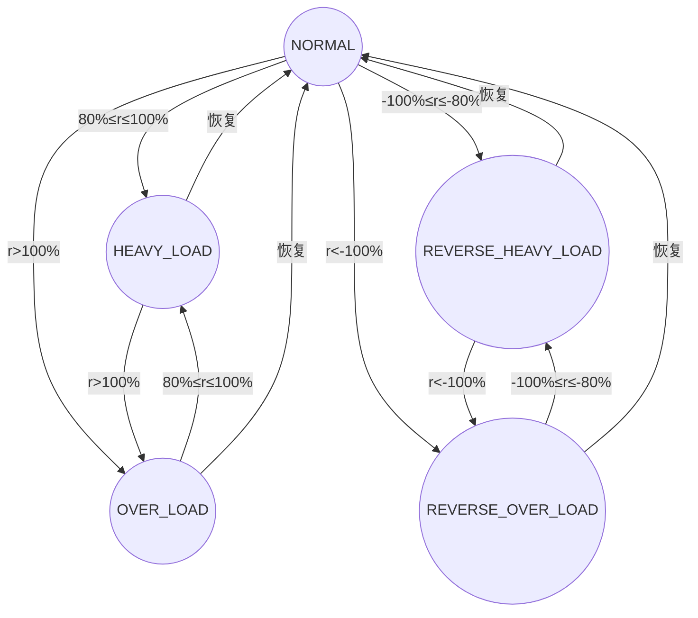

```mermaid
flowchart TD


NORMAL((NORMAL))


HEAVY((HEAVY_LOAD))

OVER((OVER_LOAD))


RHEAVY((REVERSE_HEAVY_LOAD))

ROVER((REVERSE_OVER_LOAD))


NORMAL -->|80%≤r≤100%| HEAVY
NORMAL -->|r>100%| OVER
NORMAL -->|-100%≤r≤-80%| RHEAVY
NORMAL -->|r<-100%| ROVER


HEAVY -->|r>100%| OVER

OVER -->|80%≤r≤100%| HEAVY


RHEAVY -->|r<-100%| ROVER

ROVER -->|-100%≤r≤-80%| RHEAVY


HEAVY -->|恢复| NORMAL

OVER -->|恢复| NORMAL

RHEAVY -->|恢复| NORMAL

ROVER -->|恢复| NORMAL
```