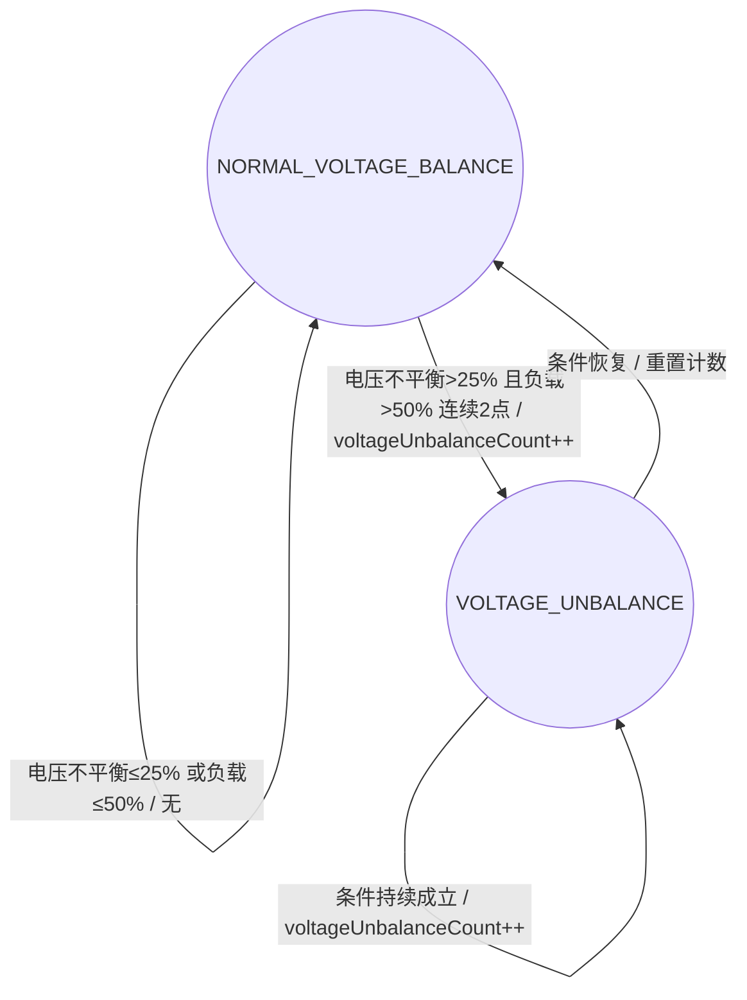

```mermaid
graph TD

NORMAL_U((NORMAL_VOLTAGE_BALANCE))
UNBALANCE_U((VOLTAGE_UNBALANCE))


NORMAL_U -->|电压不平衡≤25% 或负载≤50% / 无| NORMAL_U

NORMAL_U -->|电压不平衡>25% 且负载>50% 连续2点 / voltageUnbalanceCount++| UNBALANCE_U


UNBALANCE_U -->|条件持续成立 / voltageUnbalanceCount++| UNBALANCE_U

UNBALANCE_U -->|条件恢复 / 重置计数| NORMAL_U
```