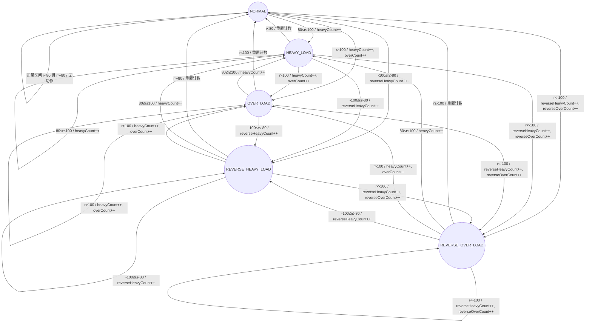

```mermaid
graph TD

NORMAL((NORMAL))
HEAVY((HEAVY_LOAD))
OVER((OVER_LOAD))
R_HEAVY((REVERSE_HEAVY_LOAD))
R_OVER((REVERSE_OVER_LOAD))


%% =====================
%% NORMAL 出边
%% =====================

NORMAL -->|正常区间 r<80 且 r>-80 / 无动作| NORMAL

NORMAL -->|80≤r≤100 / heavyCount++| HEAVY

NORMAL -->|r>100 / heavyCount++, overCount++| OVER

NORMAL -->|-100≤r≤-80 / reverseHeavyCount++| R_HEAVY

NORMAL -->|r<-100 / reverseHeavyCount++, reverseOverCount++| R_OVER


%% =====================
%% HEAVY_LOAD 出边
%% =====================

HEAVY -->|80≤r≤100 / heavyCount++| HEAVY

HEAVY -->|r<80 / 重置计数| NORMAL

HEAVY -->|r>100 / heavyCount++, overCount++| OVER

HEAVY -->|-100≤r≤-80 / reverseHeavyCount++| R_HEAVY

HEAVY -->|r<-100 / reverseHeavyCount++, reverseOverCount++| R_OVER


%% =====================
%% OVER_LOAD 出边
%% =====================

OVER -->|r>100 / heavyCount++, overCount++| OVER

OVER -->|r≤100 / 重置计数| NORMAL

OVER -->|80≤r≤100 / heavyCount++| HEAVY

OVER -->|-100≤r≤-80 / reverseHeavyCount++| R_HEAVY

OVER -->|r<-100 / reverseHeavyCount++, reverseOverCount++| R_OVER


%% =====================
%% REVERSE_HEAVY_LOAD 出边
%% =====================

R_HEAVY -->|-100≤r≤-80 / reverseHeavyCount++| R_HEAVY

R_HEAVY -->|r>-80 / 重置计数| NORMAL

R_HEAVY -->|80≤r≤100 / heavyCount++| HEAVY

R_HEAVY -->|r>100 / heavyCount++, overCount++| OVER

R_HEAVY -->|r<-100 / reverseHeavyCount++, reverseOverCount++| R_OVER


%% =====================
%% REVERSE_OVER_LOAD 出边
%% =====================

R_OVER -->|r<-100 / reverseHeavyCount++, reverseOverCount++| R_OVER

R_OVER -->|r≥-100 / 重置计数| NORMAL

R_OVER -->|80≤r≤100 / heavyCount++| HEAVY

R_OVER -->|r>100 / heavyCount++, overCount++| OVER

R_OVER -->|-100≤r≤-80 / reverseHeavyCount++| R_HEAVY
```